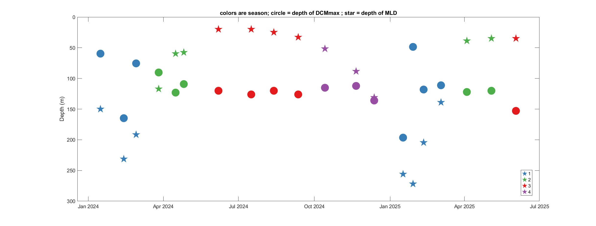

# BATSallTime
Krista Longecker, most recent notes at the top

### 12 February 2026
We need to calculate the seasons using the BATS CTD data as the gliders were not in the water much in 2024 and 2025. This repository was a good one to go back to as it works with BATS data across the years.  The code has been updated to use data available at BCO-DMO as that is a consistent format to work with and they are posting the data every six months.

Modified an existing file to read through the data and calculate the season based on Ruth Curry's code. Script is ```calcDerivedVariables_findSeasons_v5.m```, then the second step is ```calculateSeason_KL_v2.m```. Right now the seasons look like this: 

#### To do:
- [ ] check that I have the seasons right
- [ ] figure out how to use the command line in MATLAB to get the file(s) from BCO-DMO (having issues with timing out, the file is 650 MB)
- [ ] move latest files to the BIOS-SCOPE GitHub site


### 3 July 2024
Wrote ```calcDerivedVariables_BATSallTime_v4.m``` to run through all the BATS cruises and pull the set of variables needed here. Then I use ```calculateSeason_KL.m``` to go ahead and take a first pass at the boundaries for each season. This is definitely *not* perfect, so I export the results to a CSV file that gets edited manually by looking at each cruise/year result. The edited Excel file is ```seasons_wKLedits.2024.07.03.xlsx```. With that file in hand, go back to the MATLAB files to use those bounds for season rather than some automated option.

#### Some git notes for Krista
Edit file(s) on my local computer, then to get the files back to GitHub, use this set of commands to put onto GitHub:

```git add -A``` *or* ```git add MATLAB_code/\ *``` (or whatever folder you want)\
```git commit -am "Brief description goes here"``` (can use the bit in quotes to describe the update)\
```git push```\
(enter the passcode I use to get files to GitHub)
